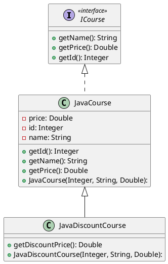
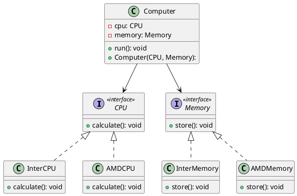
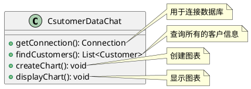
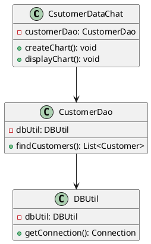
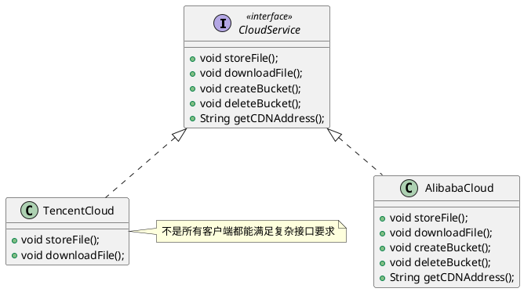
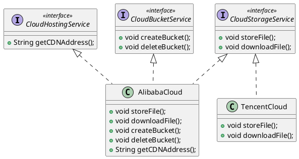
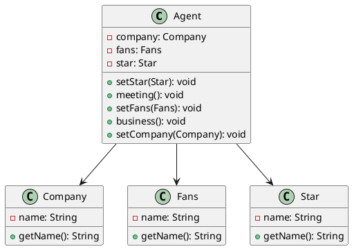
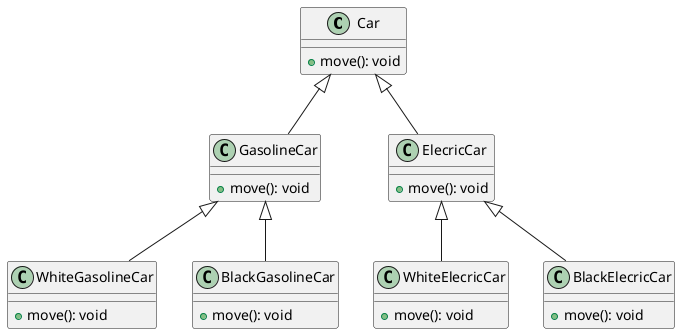
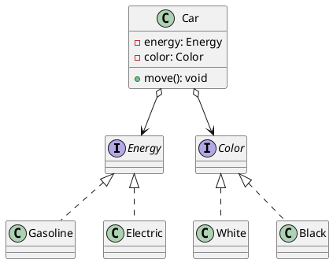

# 七大设计原则

## 开闭原则

开闭原则（Open-Closed Principle，OCP）是指一个软件实体（如类、模块和函数）应该<strong style="color:#ae3520;">对扩展开放，对修改封闭</strong>。它强调的是<strong style="color:#ae3520;">用抽象构建框架，用实现扩展细节</strong>，这样可以提高软件系统的可复用性和可维护性。开闭原则是面向对象设计中最基础的设计原则，它指导咱们如何建立稳定、灵活的系统。软件中<strong style="color:#ae3520;">易变的细节可以从抽象派生出来的实现类进行扩展</strong>，当软件需要发生变化时，只需要根据需要重新派生一个实现类来扩展即可。

<strong style="color:#ae3520;">开闭原则的核心思想就是面向抽象编程</strong>，而不是面向具体实现编程，因为抽象相对稳定。让类依赖于固定的抽象，所以对修改就是封闭的；利用面向对象中的继承与多态机制，可以针对抽象做具体实现，通过覆写其方法来改变固有行为，实现新的扩展方法，所以对扩展就是开放的。

举个栗子：以某学院的课程体系为例，首先创建一个课程接口 `ICourse`：

```java
public interface ICourse {
    Integer getId();

    String getName();
  
    Double getPrice();
}
```

整个课程生态有 Java 架构、大数据、人工智能、前端、软件测试等，咱们来创建一个 Java 架构课程的类 `JavaCourse`：

```java
public class JavaCourse implements ICourse {
    private final Integer id;
    private final String name;
    private final Double price;

    public JavaCourse(Integer id, String name, Double price) {
        this.id = id;
        this.name = name;
        this.price = price;
    }

    @Override
    public Integer getId() {
        return id;
    }

    @Override
    public String getName() {
        return name;
    }

    @Override
    public Double getPrice() {
        return price;
    }
}
```

现在咱们要给 Java 架构课程做活动，价格优惠。可能有些刚入职的小伙伴会在原有的代码上做改动，如下所示：

```java
@Override
public Double getPrice() {
  return price * 0.6;
}
```

这肯定是不符合开闭原则的，虽然这样做看起来最直接，也最简单，但是在绝大部分项目中，一个功能的实现远比想象的要复杂的多，咱们在原有的代码中进行修改，其风险远比扩展和实现一个方法要大的多，因为你永远不知道修改这行代码会对其他地方的调用结果造成什么样的影响。

那么咱们如何在不修改原有代码的前提下，实现这个价格优惠的功能呢？正确做法应该是再写一个处理优惠逻辑的类 `JavaDiscountCourse`，该类继承自 `JavaCourse` 并新增了一个获取折扣价格的方法 `getDiscountPrice()`，这个方法相当于一个扩展方法。

```java
public class JavaDiscountCourse extends JavaCourse {
    public JavaDiscountCourse(final Integer id, final String name, final Double price) {
        super(id, name, price);
    }

    public Double getDiscountPrice() {
        return super.getPrice() * 0.6;
    }
}
```

🤔思考一下，为什么不把它设计成一个共用的折扣类呢，比如 `DiscountCourse`，然后让所有的实现类都继承自这个折扣类？这是因为每种实现类的折扣方案可能是不一样的，所以咱们最好能把它作为每个实现类的子类去单独实现。如果你能确保你的业务中的新功能能兼容所有相关联的需求你也可以共用一个。

回顾一下，简单看一下类结构图，如下所示：



## 依赖倒置原则

依赖倒置原则（Dependence Inversion Principle，DIP）是指设计代码结构时，高层模块不应该依赖底层模块，两者都应该依赖其抽象。抽象不应该依赖细节，细节应该依赖抽象（High level modules shouldnot depend upon low level modules.Both should depend upon abstractions.Abstractions should not depend upon details. Details should depend upon abstractions）。其核心思想是：<strong style="color:#ae3520;">要面向接口编程，不要面向实现编程</strong>。

通过依赖倒置，可以减少类与类之间的耦合性，提高系统的稳定性，提高代码的可读性和可维护性，并且能降低修改程序所引起的风险。

大家要切记：<strong style="color:#ae3520;">以抽象为基准</strong>比以细节为基准搭建起来的框架要稳定得多，因此在拿到需求之后，<strong style="color:#ae3520;">要面向接口编程，先顶层再细节地设计代码结构</strong>。

举个栗子：假设现在咱们准备自己组装一台电脑，配置定为 Intel 的 CPU 和内存条，具体代码实现如下所示：

::: code-group

```java [InterCPU]
public class InterCPU {
    public void calculate() {
        System.out.println("Intel CPU 正在运行中...");
    }
}
```

```java [InterMemory]
public class InterMemory {
    public void store() {
        System.out.println("Intel 内存条正在存储数据中...");
    }
}
```

```java [Computer] {2-3}
public class Computer {
    private final InterCPU interCPU;
    private final InterMemory interMemory;

    public Computer(InterCPU interCPU, InterMemory interMemory) {
        this.interCPU = interCPU;
        this.interMemory = interMemory;
    }

    public void run() {
        interCPU.calculate();
        interMemory.store();
    }
}
```

```java [ComputerTest]
class ComputerTest {
    @Test
    public void test() {
        InterCPU interCPU = new InterCPU();
        InterMemory interMemory = new InterMemory();
        Computer computer = new Computer(interCPU, interMemory);
        computer.run();
    }
}
```

:::

可以看到，在 `Computer` 类中使用的是具体实现：Intel 的 CPU 和内存条。突然发现，好像自己的预算不足，这个时候怎么办？只能较低配置呗，配一套 AMD 的 CPU 和内存条。但是现在咱们在 `Computer` 电脑中已经将 CPU 和内存条定死了为 Intel 的 CPU 和内存条，要想降低配置，只能修改原先代码，无法通过扩展的方式实现。此时，就突出了依赖倒置原则的重要性，要面向接口编程，不要面向实现编程，咱们分别定义一个 `CPU` 和 `Memory` 的接口，让 `IntelCPU` 和 `IntelMemory` 分别继承自这两个接口，然后在 `Computer` 类中使用 `CPU` 和 `Memory` 这两个接口作为属性，不再使用具体实现作为属性，这样做之后，即使换一套 AMD 的配置也不需要修改 `Computer` 类中原有的代码，只需要让 `AMDCPU` 和 `AMDMemory` 分别实现这两个接口 `CPU` 和 `Memory` 即可，后续使用其他品牌的配置同样如此，无需改动原有的代码，只需在原有的基础上进行扩展即可。这样做还有一个好处，那就是我可以将不同品牌的 CPU 和 内存条混着用，照样可以正常工作。具体代码实现如下所示：

::: code-group

```java [CPU]
public interface CPU {
    void calculate();
}
```

```java [Memory]
public interface Memory {
    void store();
}
```

```java [IntelCPU]
public class InterCPU implements CPU {
    @Override
    public void calculate() {
        System.out.println("Intel CPU 正在运行中...");
    }
}
```

```java [IntelMemory]
public class InterMemory implements Memory {
    @Override
    public void store() {
        System.out.println("Intel 内存条正在存储数据中...");
    }
}
```

```java [AMDCPU]
public class AMDCPU implements CPU {
    @Override
    public void calculate() {
        System.out.println("AMD CPU 正在运行中...");
    }
}
```

```java [AMDMemory]
public class AMDMemory implements Memory {
    @Override
    public void store() {
        System.out.println("AMD 内存条正在存储数据中...");
    }
}
```

```java [Computer] {2-3}
public class Computer {
    private final CPU cpu;
    private final Memory memory;

    public Computer(final CPU cpu, final Memory memory) {
        this.cpu = cpu;
        this.memory = memory;
    }

    public void run() {
        cpu.calculate();
        memory.store();
    }
}
```

```java [ComputerTest]
class ComputerTest {
    @Test
    public void test() {
        InterCPU interCPU = new InterCPU();
        InterMemory interMemory = new InterMemory();
        Computer computer = new Computer(interCPU, interMemory);
        computer.run();
    }

    @Test
    public void test2() {
        AMDCPU amdCPU = new AMDCPU();
        AMDMemory amdMemory = new AMDMemory();
        Computer computer = new Computer(amdCPU, amdMemory);
        computer.run();
    }
}
```

:::

类结构图如下所示：



##  单一职责原则

单一职责原则（Single Responsibility Principle，SRP）是指<strong style="color:#ae3520;">类的职责要单一，不要存在多于一个导致类变更的原因</strong>。通俗的讲，如果这个类包含了两个或多个业务不相干的功能，那么这个类的职责就不够单一，应该将它<strong style="color:#ae3520;">拆分成多个功能更加单一、粒度更细的类</strong>。这样的设计，可以降低类的复杂度，提高类的可读性，提高系统的可维护性，降低变更引起的风险。总体来说，就是一个类、接口或方法只负责一项职责。

单一职责原则是实现<strong style="color:#ae3520;">高内聚、低耦合</strong>的指导方针，它是<strong style="color:#ae3520;">最简单但又是最难运用</strong>的原则，需要设计人员发现类的不同职责并将其分离，而发现类的多重职责需要设计人员具有较强的分析设计能力和相关实践经验。

举个栗子：Sunny 软件公司的开发人员针对某 CRM（Customer Relationship Management，客户关系管理）系统中客户信息图形统计模块提出如下图所示的初始设计方案：



在上图中，`CsutomerDataChat` 类承担了太多的职责，既包含与数据库相关的方法，又包含与图标生成和显示相关的方法。如果在其他类中也需要连接数据库或者使用 `findCustomers()` 方法查询客户信息，则难以实现代码的重用。无论是修改数据库连接方式还是修改图标显示方式都需要修改该类，它存在不止一个引起它变化的原因，违背了单一职责原则。因此需要对该类进行拆分，使其满足单一职责原则，`CsutomerDataChat` 类可拆分成如下三个类：

1. `DBUtil`：负责连接数据库，包含数据库连接方法 `getConnection()`；
2. `CustomerDao`：负责操作数据库中的 `Customer` 表，包含对 `Customer` 表的增删改查方法，如 `findCustomers()`；
3. `CsutomerDataChat`：负责图表的生成和显示，包含 `createChart()` 和 `displayChart()` 方法。 

使用单一职责重构后的结构如下图所示：



## 接口隔离原则

接口隔离原则（Interface Segregation Principle，ISP）是指<strong style="color:#ae3520;">用多个专门的接口，而不使用单一的总接口，客户端不应该依赖它不需要的接口</strong>。这个原则指导咱们在设计接口时应当注意以下几点：

1. 一个类对另一个类的依赖应该建立在最小的接口之上；
2. 建立单一接口，不要建立庞大臃肿的接口；
3. 尽量细化接口，接口中的方法尽量少（不是越少越好，一定要适度）。

接口隔离原则和单一职责原则都是为了提高类的内聚性，降低它们之间的耦合性，体现了封装的思想，但两者是不同的：

- 单一职责原则注重的是职责，而接口隔离原则注重的是对接口依赖的隔离；
- 单一职责原则主要是约束类，它针对的是程序中的实现和细节；而接口隔离原则主要约束接口，主要针对抽象和程序整体框架的构建。

接口隔离原则符合咱们常说的高类聚、低耦合的设计思想，可以使类具有很好的可读性、可扩展性和可维护性。咱们在设计接口的时候，要多花时间去思考，要考虑业务模型，包括对以后有可能发生变更的地方还要做一些预判。所以，对于抽象、对于业务模型的理解还是非常重要的。

举个栗子：比如咱们程序中用到公有云存储服务，所以说咱们定义一个抽象的接口 `CloudService`，在该接口中定义了咱们所有可能会用到的一些存储操作相关的方法，然后咱们底层服务通过两种能力支撑，一种是阿里云 `AlibabaCloud`，一种是腾讯云 `TencentCloud`。现在来分别实现 `CloudService` 接口的这两个实现类，对于这样一个复杂结构来说，它的实现类要实现该接口中的所有方法，但并不代表它的所有子类都能够去实现这些方法，比如说上面腾讯云的 SDK 只提供了存储文件和下载文件的能力，那对于其他方法呢它就没有办法去实现，所以对于咱们的代码来说这个子实现类 `TencentCloud` 就会有很多的空方法，也就是说它只有其名而没有实际意义，如下所示：



所以说更好的方式是把这个 `CloudService` 接口进行拆分，把它分成多个部分，然后每个客户端根据自己的实际情况去实现不同的接口，如下所示，<strong style="color:#ae3520;">一个复杂的接口被拆分成一组颗粒更小的接口</strong>，但是<strong style="color:#ae3520;">千万记住不要再进一步划分已经非常具体的接口，因为创建的接口越多代码就会越复杂，所以说咱们要在这个中间寻求平衡</strong>。



## 迪米特法则

迪米特法则（Law Of Demeter，LOD）又叫最少知道原则（Least Knowledge Principle，LKP），是指<strong style="color:#ae3520;">一个类对于其他类知道的越少越好</strong> & <strong style="color:#ae3520;">只与你的直接朋友交流，不跟“陌生人”说话</strong>（Talk only to your immediate friends and not to strangers）。其含义是：<strong style="color:#ae3520;">如果两个软件实体无需直接通信，那么就不应当发生直接的相互调用，可以通过第三方转发该调用</strong>。其目的是降低类之间的耦合度，提高模块的相对独立性。

迪米特法则中的“朋友”是指：

- 朋友：有耦合关系（同当前对象存在<strong style="color:#ae3520;">依赖、关联、聚合或组合</strong>关系）的对象，可以直接访问这些对象的方法。
- <strong style="color:#ae3520;">直接的朋友：出现在成员变量、方法输入、输出参数中的类</strong>，而<strong style="color:#ae3520;">出现在方法体内部中的类就不属于朋友类</strong>。

举个栗子：明星由于全身心投入艺术，所以许多日常事务由经纪人负责处理，如与粉丝的见面会，与媒体公司的业务洽谈等。这里的经纪人就是明星的朋友，而粉丝和媒体公司就是陌生人，所以适合使用迪米特法则。其类结构图如下所示：



具体代码实现如下所示：

::: code-group

```java [Star]
public class Star {
    private final String name;

    public Star(final String name) {
        this.name = name;
    }

    public String getName() {
        return name;
    }
}
```

```java [Fans]
public class Fans {
    private final String name;

    public Fans(final String name) {
        this.name = name;
    }

    public String getName() {
        return name;
    }
}
```

```java [Company]
public class Company {
    private final String name;

    public Company(final String name) {
        this.name = name;
    }

    public String getName() {
        return name;
    }
}
```

```java [Agent]
public class Agent {
    private Star star;
    private Fans fans;
    private Company company;

    public void setStar(final Star star) {
        this.star = star;
    }

    public void setFans(final Fans fans) {
        this.fans = fans;
    }

    public void setCompany(final Company company) {
        this.company = company;
    }

    public void meeting() {
        System.out.println(this.fans.getName() + "与明星" + this.star.getName() + "见面了！");
    }

    public void business() {
        System.out.println(this.company.getName() + "与明星" + this.star.getName() + "洽淡业务！");
    }
}
```

```java [AgentTest]
class AgentTest {
    @Test
    public void test() {
        Star star = new Star("刘亦菲");
        Fans fans = new Fans("小让");
        Company company = new Company("中国传媒有限公司");
        Agent agent = new Agent();
        agent.setStar(star);
        agent.setFans(fans);
        agent.setCompany(company);
        agent.meeting();
        agent.business();
    }
}
```

:::

## 里氏替换原则

里氏替换原则（Liskov Substitution Principle，LSP）是指一个软件实体如果适用于一个父类，那么一定适用于其子类，<strong style="color:#ae3520;">程序中所有使用父类对象的地方必须能透明地使用其子类对象进行替换，并且保证原来程序的逻辑行为不变以及正确性不被破坏</strong>。根据这个理解，引申含义为：<strong style="color:#ae3520;">子类可以扩展父类的功能，但不能改变父类原有的功能</strong>。这句话包括了四点含义：

1. 子类可以实现父类的抽象方法，但不能覆盖父类的非抽象方法；
2. 子类可以增加自己特有的方法；
3. 当子类的方法重载父类的方法时，方法的前置条件（即方法的输入参数）要比父类的方法更宽松；
4. 当子类的方法实现父类的方法（重写/重载或实现抽象方法）时，方法的后置条件要（即方法的输出/返回值）要比父类的方法更严格或与父类的方法一样。

使用里氏替换原则有以下优点：

1. 约束继承泛滥，是使代码符合开闭原则的一个重要保证；
2. 加强程序的健壮性，同时变更时也可以做到非常号的兼容性，提高程序的可维护性和扩展性，降低需求变更时引入的风险。

举个栗子：“正方形不是长方形”是一个理解里氏替换原则的最经典的例子。在数学领域中，正方形毫无疑问是长方形，它是一个长宽相等的长方形。所以，在咱们开发的一个与几何图形相关的软件系统中，让正方形继承自长方形就成了一件顺理成章的事情。

首先，创建一个长方形类 `Rectangle`：

```java
public class Rectangle {
    private long length;
    private long width;

    public long getLength() {
        return length;
    }

    public void setLength(final long length) {
        this.length = length;
    }

    public long getWidth() {
        return width;
    }

    public void setWidth(final long width) {
        this.width = width;
    }
}
```

然后，创建一个正方形类 `Square` 继承自 `Rectangle` 长方形类：由于正方形的长宽必须相等，所以不管是在 `setWidth()` 方法还是在 `setLength()` 方法中都会同时对长宽赋以相同的值。

```java
public class Square extends Rectangle {
    @Override
    public void setWidth(final long width) {
        super.setWidth(width);
        super.setLength(width);
    }

    @Override
    public void setLength(final long length) {
        super.setWidth(length);
        super.setLength(length);
    }
}
```

在测试类中创建 `resize()` 方法，用于模拟长方形宽度逐步增长直至宽度大于长度时停止的效果：

```java
class RectangleTest {
    public void resize(final Rectangle rectangle) {
        while (rectangle.getWidth() <= rectangle.getLength()) {
            rectangle.setWidth(rectangle.getWidth() + 1);
            System.out.println("length:" + rectangle.getLength() + ",width:" + rectangle.getWidth());
        }
    }

    @Test
    public void test() {
        final Rectangle rectangle = new Rectangle();
        rectangle.setLength(10);
        rectangle.setWidth(5);
        resize(rectangle);
    }
}
```

在上述测试方法，咱们把一个普通的长方形作为参数传入 `resize()` 方法中，就会看到长方形宽度逐步增长直至宽度大于长度时停止的效果，运行结果如下所示：<br />

现在，我们再把一个正方形作为参数传入 `resize()` 方法中，

```java
@Test
public void test1() {
  final Square square = new Square();
  square.setLength(10);
  resize(square);
}
```

运行上述测试方法，就会看到正方形的长度和宽度都在不断地增长，代码出现死循环直至堆栈溢出才会停止。所以，普通的长方形是适合这段代码的，而正方形却不适合。

所以咱们得出如下结论：在 `resize()` 方法中，`Rectangle` 类型的参数是不能被 `Square` 类型的参数所替换，如果进行了替换就达不到预期结果。因此，`Square` 类和 `Rectangle` 类之间的继承关系违反了里氏替换原则，它们之间的继承关系不成立 ➡️ 正方形不是长方形。

## 合成复用原则

合成复用原则（Composite Reuse Principle，CRP）是指<strong style="color:#ae3520;">尽量使用对象聚合（has-a）/组合（contains-a）而不是继承（is-a）关系达到软件复用的目的</strong>。

> [!tip]
>
> 聚合关系（Aggregation）是关联关系中的一种特例，它**体现的是整体与部分的包含关系，即 “**has a**” 的关系。**聚合关系强调是“整体”包含“部分”，但是“部分”可以脱离“整体”而单独存在，即整体和部分是**可以分离**的，**有各自的生命周期**。在UML类图中，聚合关系用**带空心菱形和箭头的直线**表示，**空心菱形在整体一方**，**箭头指向部分一方**。如下图所示：公司包含销售、工程师和会计等人员，而销售、工程师和会计脱离了公司也能单独存在。
>
> ```plantuml
> @startuml
> 
> class Company {
> 	- salesman: Salesman
> 	- engineer: Engineer
> 	- accountant: Accountant
> }
> 
> class Salesman {}
> 
> class Engineer {}
> 
> class Accountant {}
> 
> Company o-- Salesman
> Company o-- Engineer
> Company o-- Accountant
> 
> @enduml
> ```
>
> 组合关系（Composition）也是关联关系的一种特例，它同样**体现的是整体与部分间的包含关系**，即 “**contains a**” 的关系。但此时**整体与部分是不可分的**，部分也不能给其它整体共享，**整体可以控制部分的生命周期**，**整体一旦不存在**，**部分也便不存在**。这种关系比聚合更强，也称为**强聚合**。在UML类图中，组合关系用**带实心菱形和箭头的直线**表示，**实心菱形在整体一方**，**箭头指向部分一方**。如下图所示，人包含头（head）、躯干（limbs）、四肢（torso），它们的生命周期一致。当人出生时，头、躯干、四肢同时诞生。当人死亡时，作为人体组成部分的头、躯干、四肢则同时死亡。
>
> ```plantuml
> @startuml
> 
> class Person {
>   - head: Head
> 	- limbs: Limbs
> 	- torso: Torso
> }
> 
> class Head {}
> 
> class Limbs {}
> 
> class Torso {}
> 
> Person *--> Head 
> Person *--> Limbs
> Person *--> Torso
> 
> @enduml
> ```

通常类的复用分为<strong style="color:#ae3520;">继承复用</strong>和<strong style="color:#ae3520;">合成复用</strong>两种。继承复用虽然有简单和易实现的优点，但它存在以下缺点：

1. 继承复用破坏了类的封装性。因为<strong style="color:#ae3520;">继承会将父类的实现细节暴露给子类，父类对子类是透明的</strong>，所以这种复用又称之为“白箱”复用。
2. 子类与父类的耦合度高。父类中的任何改变都会导致子类实现发生变化，这不利于类的扩展与维护。
3. 它限制了复用的灵活性。从父类继承而来的实现是静态的，在编译时已经定义，因此在运行时不能发生变化。

采用组合或聚合复用时，可以将已有对象纳入新对象中，使之成为新对象的一部分，新对象可以调用已有对象的功能，它有以下优点：

1. 它维持了类的封装性。因为成员对象的内部细节是新对象看不见的，所以这种复用又称之为“黑箱”复用。
2. 相对于继承关系而言，耦合度较低，<strong style="color:#ae3520;">在类的成员位置声明抽象（抽象类或者接口）</strong>，成员对象的变化对新对象的影响不大，可以在新对象中根据实际需要有选择性地调用成员对象的操作。
3. 复用的灵活性高。这种复用可以在运行时动态进行，<strong style="color:#ae3520;">新对象可以动态的引用与成员对象类型相同的其他对象</strong>。

举个栗子：汽车按照动力源可以分为汽油汽车、电动汽车等；按照颜色可以分为白色汽车、黑色汽车等。如果同时考虑这两种分类的话，其组合就会有很多种。如下图所示是用继承关系实现的汽车分类的类结构图：



从上图可以看出用继承关系实现会产生很多的子类，而且增加新的动力源和颜色时会增加更多的子类，可以发现扩展起来是非常麻烦的，因此咱们可以使用合成复用来改进一下代码，如下图所示：



