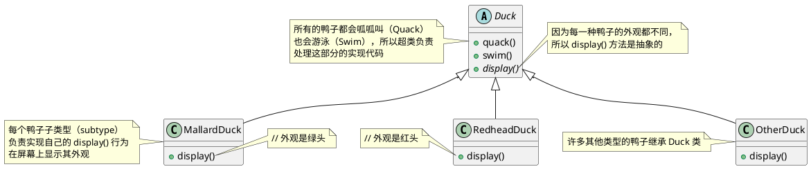
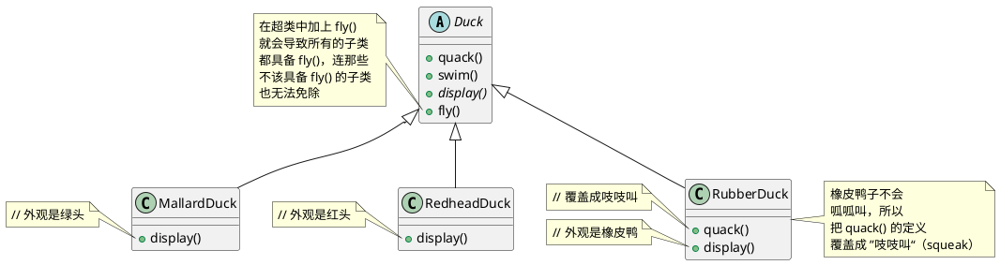
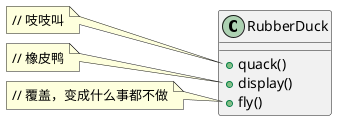
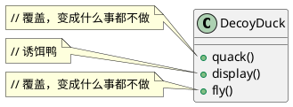
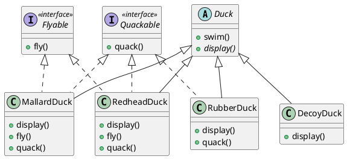
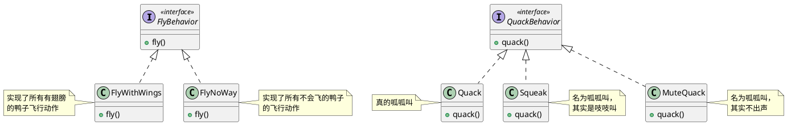
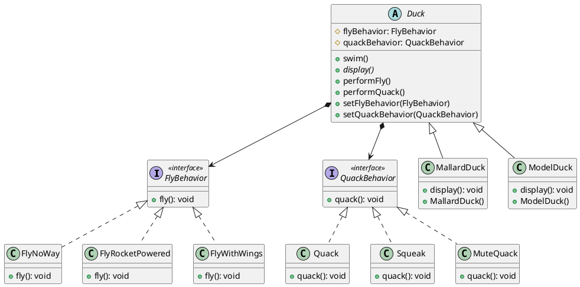
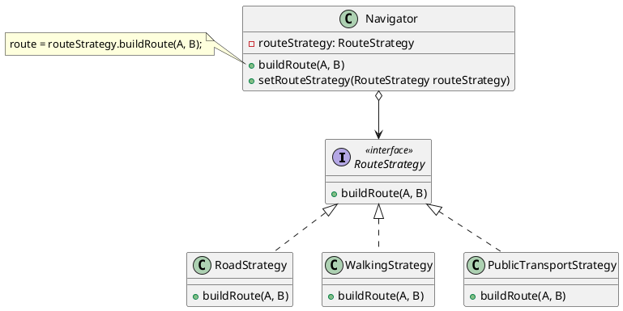
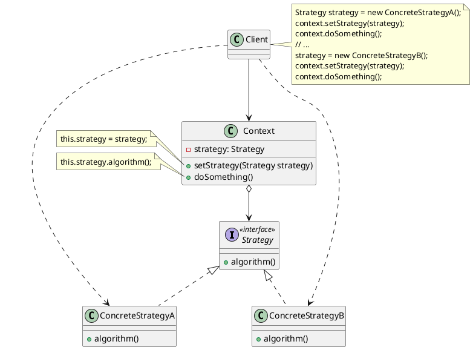

# 策略模式（Strategy Pattern）

## 定义

<strong style="color:#ae3520;">定义一组算法，将每个算法都封装起来，并且使它们之间可以相互替换</strong>（Define a family of algorithms, encapsulate each one and make them interchangeable）。策略模式让算法的变化独立于使用它的客户，也称之为政策模式（Policy）。


## 案例一：模拟鸭子游戏

### 先从简单的模拟鸭子应用做起

Joe 上班的公司做了一套相当成功的模拟鸭子游戏：SimUDuck。游戏中会出现各种鸭子，一边游泳戏水，一边呱呱叫。此系统的内部设计使用了标准的 OO（Object Oriented，面向对象）技术，设计了一个鸭子超类，并让各种鸭子继承此超类。



### 现在我们得让鸭子能飞

去年，公司的竞争压力加剧。在为期一周得到高尔夫假期兼头脑风暴会议之后，公司主管认为此模拟程序需要会飞的鸭子来将竞争者抛在后头。

经理：拍着胸脯告诉主管们，Joe 只需要一个星期就可以搞定。

Joe：接到需求，想到只需要在 `Duck` 类中加上 `fly()` 方法，然后所有的鸭子都会继承 `fly()`。

### 但是，可怕的问题发生了……

经理：打电话告诉 Joe，在股东会议上看了一下展示，发现一堆的 “橡皮鸭子” 在屏幕上飞来飞去，你是在开玩笑吗？

这是怎么回事呢？其实 Joe 忽略一件事：并非 `Duck` 的所有子类都会飞。Joe 在 `Duck` 超类中加上新的行为，会使得某些并不适合该行为的子类也具有该行为。

### Joe 想到用继承



Joe：我可以把橡皮鸭中的 `fly()` 方法给覆盖掉，就像覆盖 `quack()` 方法的做法一样。



Joe：可是，如果以后我加入诱饵鸭（DecoyDuck），又会如何？诱饵鸭是木头假鸭，不会飞也不会叫。



Joe 认识到继承可能不是答案，因为每当有新的鸭子子类出现，他就要被迫检查并可能需要覆盖 `fly()` 和 `quack()` 等方法，这简直是无穷无尽的噩梦。所以，他需要一个更清晰的方法，让 ”某些“（而不是全部）鸭子类型可飞或可叫。

### 利用接口如何？

Joe：我可以把 `fly()` 从超类中取出来，放进一个 `Flyable` 接口中。这么一来，只有会飞的鸭子才实现此接口。同样的方式，也可以用来设计一个 `Quackable` 接口，因为不是所有的鸭子都会叫。



经理：这真是一个超笨的主意，你没发现这么一来重复的代码会变多吗？如果你认为覆盖几个方法就算是差劲，那么对于 48 个 `Duck` 子类都要稍微修改一下飞行的行为，你又怎么说？！

### 把问题归零……

现在咱们知道使用继承并不能很好地解决问题，因为鸭子的行为在子类里不断改变，并且让所有的子类都有这种行为是不恰当的。`Flyable` 和 `Quackable` 接口一开始似乎还挺不错，解决了问题（只有会飞的鸭子才实现 `Flyable` 接口），但是 Java 接口不具有实现代码，所以继承接口无法达到代码的复用。这意味着：无论何时你需要修改某个行为，你必须往下追踪并在每一个定义此行为的类中修改它，一不小心，可能会造成新的错误！

幸运的是，有一个设计原则：”<strong style="color:#ae3520;font-size:19px;">找出应用中可能需要变化之处，把它们独立出来，不要和那些不需要变化的代码混在一起</strong>“，恰好适用于此状况。

换句话说，如果每次新的需求一来，都会使某方面的代码发生变化，那么你就可以确定，这部分的代码需要被抽出来，和其他稳定的代码有所区分。

下面是这个原则的另一种思考方式：<strong style="color:#ae3520;font-size:19px;">把会变化的部分取出并封装起来，以便以后可以轻易地改动和扩充此部分，而不影响不需要变化的其他部分</strong>。

好，该是时候把鸭子的行为从 `Duck` 类中取出的时候了！

### 分开变化和不会变化的部分

从哪里开始呢？就咱们目前所知，除了 `fly()` 和 `quack()` 的问题之外，`Duck` 还算一切正常，似乎没有特别需要经常变化或修改的地方。所以，除了某些小改变之外，咱们不打算对 `Duck` 类做太多处理。

现在，为了要分开 ”变化和不会变化的部分“，咱们准备建立两组类，一个是 “fly” 相关的，一个是 “quack” 相关的，每一组类将实现各自的动作。比方说，咱们可能有一个类实现 “呱呱叫”，另一个类实现 “吱吱叫”，还有一个类实现 “安静”。

咱们知道 `Duck` 类中的 `fly()` 和 `quack()` 会随着鸭子的不同而改变。为了要把这两个行为从 `Duck` 类中分开，咱们将把它们从 `Duck` 类取出来，建立一组新类来代表每个行为。


### 设计鸭子的行为

如何设计那组实现飞行和呱呱叫的行为的类呢？

咱们希望一切能有弹性，毕竟，正是因为一开始鸭子行为没有弹性，才让咱们走上现在这条路。咱们还想能够 “指定” 行为到鸭子的实例。比方说：咱们想要产生一个新的绿头鸭实例，并指定特定 “类型” 的飞行行为给它。干脆顺便让鸭子的行为可以动态地改变好了。换句话说，咱们应该在鸭子类中包含设定行为的方法，这样就可以在 “运行时” 动态地 “改变” 绿头鸭的飞行行为。

有了这些目标要实现，接着看看第二个设计原则：<strong style="color:#ae3520;font-size:19px;">针对接口编程，而不是针对实现编程</strong>。

> [!tip]
>
> “针对接口编程” 真正的意思是 “针对超类型（supertype）编程”。
>
> 这里所谓的 “接口” 有多个含义，接口是一个 “概念”，也是一种 Java 的 interface 构造。你可以在不涉及 Java interface 的情况下，“针对接口编程”，关键在于<strong style="color:#ae3520;font-size:19px;">多态</strong>。利用多态，程序可以针对超类型编程，执行时会根据实际状况执行到真正的行为，不会被绑死在超类型的行为上。“针对超类型编程” 这句话，可以更明确地说成 “变量的声明类型应该是超类型，通常是一个抽象类或者是一个接口，如此，只要是具体实现此超类型的类所产生的对象，都可以指定给这个变量。这也意味着，声明类时不用理会以后执行时的真正对象类型！”

咱们利用接口代表每个行为，比方说：`FlyBehavior` 和 `QuackBehavior`，而行为的每个实现都将实现其中的一个接口。

所以这次鸭子类不会负责实现 `Flyable` 和 `Quackable` 接口，反而是由咱们制造的一组其他类专门实现 `FlyBehavior` 和 `QuackBehavior`，这就称为 “行为” 类。由行为类而不是 `Duck` 类来实现行为接口。

这样的做法迥异于以往，以往的做法是：行为来自 `Duck` 超类的具体实现，或是继承某个接口并由子类自行实现而来。这两种做法都是依赖于 “实现”，咱们被实现绑得死死的，没办法更改行为（除非写更多的代码）。

在咱们的新设计中，鸭子的子类将使用接口（`FlyBehavior` 和 `QuackBehavior`）所表示的行为，所以实际的 “实现” 不会被绑死在鸭子的子类中。换句话说，特定的具体行为编写在实现了 `FlyBehavior` 和 `QuackBehavior` 的类中。

### 实现鸭子的行为



这样的设计，可以让飞行和呱呱叫的动作被其他的对象复用，因为这些行为已经与鸭子类无关了。而咱们可以新增一些行为，不会影响到既有的行为类，也不会影响 “使用” 到飞行行为的鸭子类。这么一来，有了继承的 “复用” 好处，却没有继承所带来的包袱。

### 整合鸭子的行为

关键在于，鸭子现在会将飞行和呱呱叫的动作 “<strong style="color:#ae3520;">委托（delegate）</strong>” 别人处理，而不是使用定义在 `Duck` 类（或子类）内的呱呱叫和飞行方法。

最终的类结构图如下所示：



具体代码实现如下所示：

::: code-group

```java [FlyBehavior]
public interface FlyBehavior {
  void fly();
}
```

```java [FlyWithWings]
public class FlyWithWings implements FlyBehavior {
  @Override
  public void fly() {
    System.out.println("I'm flying!!");
  }
}
```

```java [FlyNoWay]
public class FlyNoWay implements FlyBehavior {
  @Override
  public void fly() {
    System.out.println("I can't fly");
  }
}
```

```java [FlyRocketPowered]
public class FlyRocketPowered implements FlyBehavior {
  @Override
  public void fly() {
    System.out.println("I'm flying with a rocket!");
  }
}
```

```java [QuackBehavior]
public interface QuackBehavior {
  void quack();
}
```

```java [Quack]
public class Quack implements QuackBehavior {
  @Override
  public void quack() {
    System.out.println("Quack");
  }
}
```

```java [Squeak]
public class Squeak implements QuackBehavior {
  @Override
  public void quack() {
    System.out.println("Squeak");
  }
}
```

```java [MuteQuack]
public class MuteQuack implements QuackBehavior {
  @Override
  public void quack() {
    System.out.println("<< Silence >>");
  }
}
```

```java [Duck]
public abstract class Duck {
  protected FlyBehavior flyBehavior;
  protected QuackBehavior quackBehavior;

  public Duck() {
  }

  public abstract void display();

  public void performFly() {
    flyBehavior.fly();
  }

  public void performQuack() {
    quackBehavior.quack();
  }

  public void swim() {
    System.out.println("All ducks float, even decoys!");
  }

  public void setFlyBehavior(final FlyBehavior flyBehavior) {
    this.flyBehavior = flyBehavior;
  }

  public void setQuackBehavior(final QuackBehavior quackBehavior) {
    this.quackBehavior = quackBehavior;
  }
}
```

```java [MallardDuck]
public class MallardDuck extends Duck {
  public MallardDuck() {
    flyBehavior = new FlyWithWings();
    quackBehavior = new Quack();
  }

  @Override
  public void display() {
    System.out.println("I'm a real Mallard duck");
  }
}
```

```java [ModelDuck]
public class ModelDuck extends Duck {
  public ModelDuck() {
    flyBehavior = new FlyNoWay();
    quackBehavior = new Quack();
  }

  @Override
  public void display() {
    System.out.println("I'm a model duck");
  }
}
```

```java [MiniDuckSimulator]
class MiniDuckSimulator {
  @Test
  public void test() {
    final Duck mallardDuck = new MallardDuck();
    mallardDuck.performQuack();
    mallardDuck.performFly();

    final Duck modelDuck = new ModelDuck();
    modelDuck.performFly();
    modelDuck.setFlyBehavior(new FlyRocketPowered());
    modelDuck.performFly();
  }
}
```

:::

### “有一个” 可能比 “是一个” 更好

“有一个” 关系相当有趣：每一个鸭子都有一个 `FlyBehavior` 和一个 `QuackBehavior`，好将飞行和呱呱叫委托给它们代为处理。当你将两个类结合起来使用，如同本例一样，这就是<strong style="color:#ae3520;">组合（composition）</strong>。这种做法和 “继承” 不同的地方在于，鸭子的行为不是继承来的，而是和适当的行为对象 “组合” 来的。

这是一个很重要的技巧。其实是使用了咱们的第三个设计原则：<strong style="color:#ae3520;font-size:19px;">多用组合，少用继承</strong>。

如你所见，使用组合建立系统具有很大的弹性，不仅可以将算法族封装成类，更可以 “在运行时动态地改变行为”，只要组合地行为对象符合正确地接口标准即可。

## 案例二：导游程序

### 问题

一天，你打算为游客们创建一款导游程序。该程序的核心功能是提供美观的地图，以帮助用户在任何城市中快速定位。

用户期待的程序新功能是自动路线规划：他们希望输入地址后就能在地图上看到前往目的地的最快路线。

程序的首个版本只能规划公路路线。驾车旅行的人们对此非常满意。但很显然，并非所有人都会在度假时开车。因此你在下次更新时添加了规划步行路线的功能。此后，你又添加了规划公共交通路线的功能。

而这只是个开始。不久后，你又要为骑行者规划路线。又过了一段时间，你又要为游览城市中的所有景点规划路线。


尽管从商业角度来看，这款应用非常成功，但其技术部分却让你非常头疼： 每次添加新的路线规划算法后，导游应用中主要类的体积就会增加一倍。终于在某个时候，你觉得自己没法继续维护这堆代码了。

无论是修复简单缺陷还是微调街道权重，对某个算法进行任何修改都会影响整个类，从而增加在已有正常运行代码中引入错误的风险。

此外，团队合作将变得低效。如果你在应用成功发布后招募了团队成员，他们会抱怨在合并冲突的工作上花费了太多时间。在实现新功能的过程中，你的团队需要修改同一个巨大的类，这样他们所编写的代码相互之间就可能会出现冲突。

### 解决方案

策略模式建议<strong style="color:#ae3520;">先找出负责用许多不同方式完成特定任务的类，然后将其中的算法抽取到一组被称为*策略*的独立类中</strong>。

<strong style="color:#ae3520;">名为*上下文*的原始类必须包含一个成员变量来存储对于每种策略的引用。上下文并不执行任务，而是将工作委派给已连接的策略对象</strong>。

<strong style="color:#ae3520;">上下文不负责选择符合任务需要的算法——客户端会将所需策略传递给上下文。实际上，上下文并不十分了解策略 它会通过同样的通用接口与所有策略进行交互， 而该接口只需暴露一个方法来触发所选策略中封装的算法即可</strong>。

因此，上下文可独立于具体策略。这样你就可在不修改上下文代码或其他策略的情况下添加新算法或修改已有算法了。



在导游应用中，每个路线规划算法都可被抽取到只有一个 `build­Route` 生成路线方法的独立类中。该方法接收起点和终点作为参数，并返回路线中途点的集合。

即使传递给每个路径规划类的参数一模一样，其所创建的路线也可能完全不同。主要导游类的主要工作是在地图上渲染一系列中途点，不会在意如何选择算法。 该类中还有一个用于切换当前路径规划策略的方法，因此客户端（例如用户界面中的按钮）可用其他策略替换当前选择的路径规划行为。

## 真正世界类比


假如你需要前往机场。你可以选择乘坐公共汽车、预约出租车或骑自行车。 这些就是你的出行策略。你可以根据预算或时间等因素来选择其中一种策略。

## 模式结构



策略模式包含如下角色：

1. 抽象策略接口（Strategy）：是所有具体策略的通用接口，它声明了一个上下文用于执行策略的方法。
2. 具体策略类（Concrete Strategy）：实现了上下文所用算法的各种不同变体。
3. 上下文（Context）：也称之为环境类，维护指向具体策略的引用，且仅通过策略接口与该对象进行交流。
4. 客户端（Client）：会创建一个特定策略对象并将其传递给上下文，上下文则会提供一个设置器以便在运行时替换相关联的策略。

## 应用场景

- 🐞 **当你想使用对象中各种不同的算法变体，并希望能在运行时切换算法时，可使用策略模式。**

  ⚡ 策略模式让你能够将对象关联至可以不同方式执行特定子任务的不同子对象， 从而以间接方式在运行时更改对象行为。

- 🐞 **当你有许多仅在执行某些行为时略有不同的相似类时，可使用策略模式。**

  ⚡ 策略模式让你能将不同行为抽取到一个独立类层次结构中，并将原始类组合成同一个，从而减少重复代码。

- 🐞 **如果算法在上下文的逻辑中不是特别重要，使用该模式能将类的业务逻辑与其算法实现细节隔离开来。**

  ⚡ 策略模式让你能将各种算法的代码、内部数据和依赖关系与其他代码隔离开来。不同客户端可通过一个简单接口执行算法，并能在运行时进行切换。

- 🐞 **当类中使用了复杂条件运算符以在同一算法的不同变体中切换时，可使用该模式。**

  ⚡ 策略模式将所有继承自同样接口的算法抽取到独立类中，因此不再需要条件语句。 原始对象并不实现所有算法的变体，而是将执行工作委派给其中的一个独立算法对象。

## 实现方式

1. 从上下文类中找出修改频率较高的算法（也可能是用于在运行时选择某个算法变体的复杂条件运算符）。
2. 声明该算法所有变体的通用策略接口。
3. 将算法逐一抽取到各自的类中，它们都必须实现策略接口。
4. 在上下文类中添加一个成员变量用于保存对于策略对象的引用，然后提供设置器以修改该成员变量，上下文仅可通过策略接口同策略对象进行交互。
5. 客户端必须将上下文类与相应策略进行关联，使上下文可以以预期的方式完成其主要工作。

## 优缺点

- ✔️可以在运行时切换对象内的算法。

- ✔️可以将算法的实现和使用算法的代码隔离开来。

- ✔️可以使用组合来代替继承。
- ✔️满足开闭原则，无需对上下文进行修改就能够引入新的策略。

- ❌如果你的算法极少发生改变，那么没有任何理由引入新的类和接口。使用该模式只会让程序过于复杂。
- ❌客户端必须知晓策略间的不同——它需要选择合适的策略。
- ❌许多现代编程语言支持函数类型功能，<strong style="color:#ae3520;">允许你在一组匿名函数中实现不同版本的算法</strong>。这样，你使用这些函数的方式就和使用策略对象时完全相同，无需借助额外的类和接口来保持代码简洁。 ➡️ Lambda 表达式，类似于 JDK 中的 [Comparator (Java Platform SE 8 ) (oracle.com)](https://docs.oracle.com/javase/8/docs/api/java/util/Comparator.html) 函数式接口。

