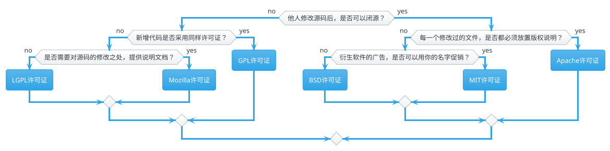

# 如何选择开源协议

> 本节内容全部来源于 [如何选择开源许可证？ - 阮一峰的网络日志 (ruanyifeng.com)](https://www.ruanyifeng.com/blog/2011/05/how_to_choose_free_software_licenses.html)

如何为代码选择开源许可证，这是一个问题。

世界上的开源许可证，大概有 [上百种](https://www.gnu.org/licenses/license-list.html)。很少有人搞得清楚它们的区别。即使在最流行的六种：[GPL](https://www.gnu.org/licenses/gpl-3.0.html)、[BSD](https://en.wikipedia.org/wiki/BSD_licenses)、[MIT](https://en.wikipedia.org/wiki/MIT_License)、[Mozilla](https://www.mozilla.org/en-US/MPL/)、[Apache](https://www.apache.org/licenses/LICENSE-2.0) 和 L[GPL](https://www.gnu.org/licenses/lgpl-3.0.html) 之中做选择，也很复杂。

乌克兰程序员 [Paul Bagwell](https://web.archive.org/web/20110503183702/http://pbagwl.com/post/5078147450/description-of-popular-software-licenses) 画了一张分析图，说明应该怎么选择。这是我见过的最简单的讲解，只用两分钟，你就能搞清楚这六种许可证之间的最大区别。

